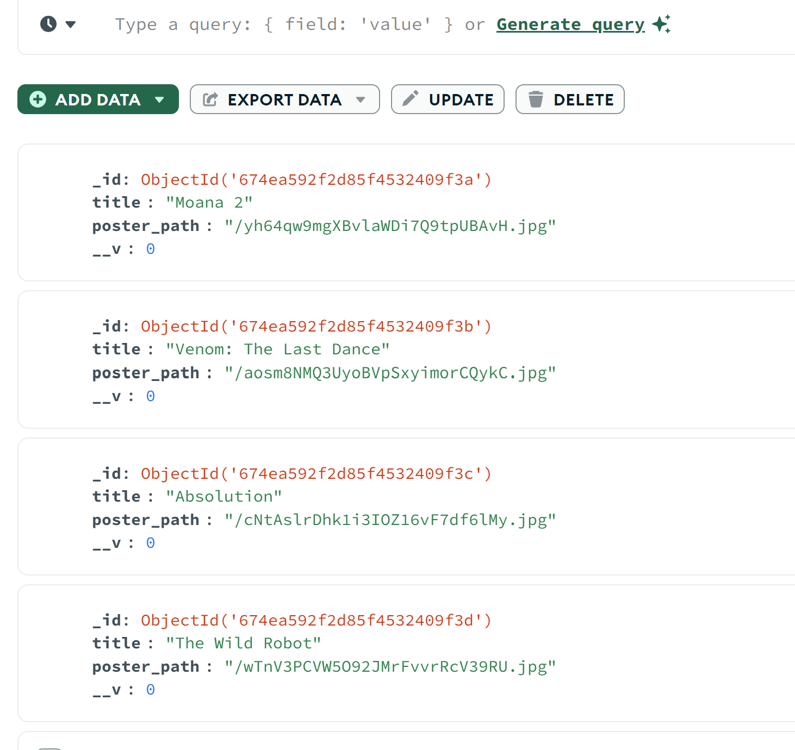

USAGE:

Example usage is using the movie database org API.

```
https://www.themoviedb.org
```

Sign up for an api key:

```
https://www.themoviedb.org/settings/api
```

Create a database/collection on MongoDB Atlas, grab the connection string and insert it into your config/connection.js. Be sure you include the database name in the connection string otherwise it will just point to 'test'.
I left the connection string exposed in my connection.js if you need to see what it looks like.

Go to insomnia and hit the endpoint you are interested in with your api key.

Once you have it working and your response object is correct, click the down arrow next to the send button and choose to create client code with javascript/fetch.

Make sure you install node-fetch@2 so that you can use fetch on the server side. 

Paste the client code into the seed.js
Refer to seed.js for remaining code.

This particular api only gives part of the poster path, as it should to reduce repetative code stored in the the db, so here is how to construct the whole poster path for your code:

````
https://image.tmdb.org/t/p/original/5ik4ATKmNtmJU6AYD0bLm56BCVM.jpg
````

example response for the endpoint in the code:

````
{
  "dates": {
    "maximum": "2024-12-04",
    "minimum": "2024-10-23"
  },
  "page": 1,
  "results": [
    {
      "adult": false,
      "backdrop_path": "/tElnmtQ6yz1PjN1kePNl8yMSb59.jpg",
      "genre_ids": [
        16,
        12,
        10751,
        35
      ],
      "id": 1241982,
      "original_language": "en",
      "original_title": "Moana 2",
      "overview": "After receiving an unexpected call from her wayfinding ancestors, Moana journeys alongside Maui and a new crew to the far seas of Oceania and into dangerous, long-lost waters for an adventure unlike anything she's ever faced.",
      "popularity": 6947.74,
      "poster_path": "/yh64qw9mgXBvlaWDi7Q9tpUBAvH.jpg",
      "release_date": "2024-11-27",
      "title": "Moana 2",
      "video": false,
      "vote_average": 7.01,
      "vote_count": 250
    },
  }
]
````


Use the Bearer token method of authenticating.

Compass:

